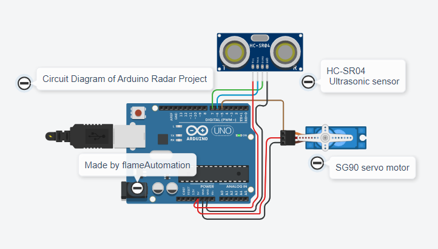
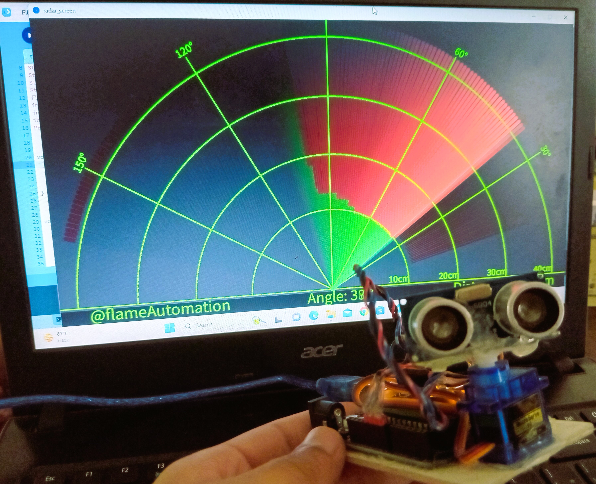

## Ultrasonic Radar via `Arduino`

Detect any object that comes in the range of this radar with ultrasonic sensor and Arduino.

|  | 
|:--:|:--:|
| *Schematic Diagram* | *Demo View* |

### Components and Supplies

* SG90 Micro-servo motor x 1
* Ultrasonic Sensor - HC-SR04 x 1
* Arduino UNO x 1

### Apps and Platforms

* [Processing](https://processing.org/)
* [Arduino IDE](https://www.arduino.cc/en/software)

